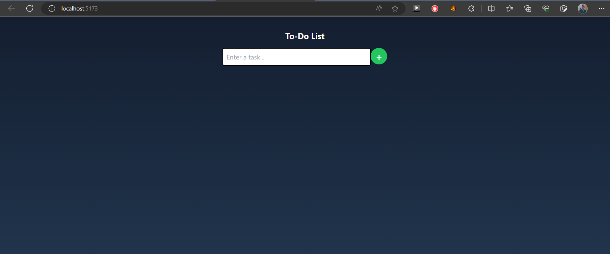
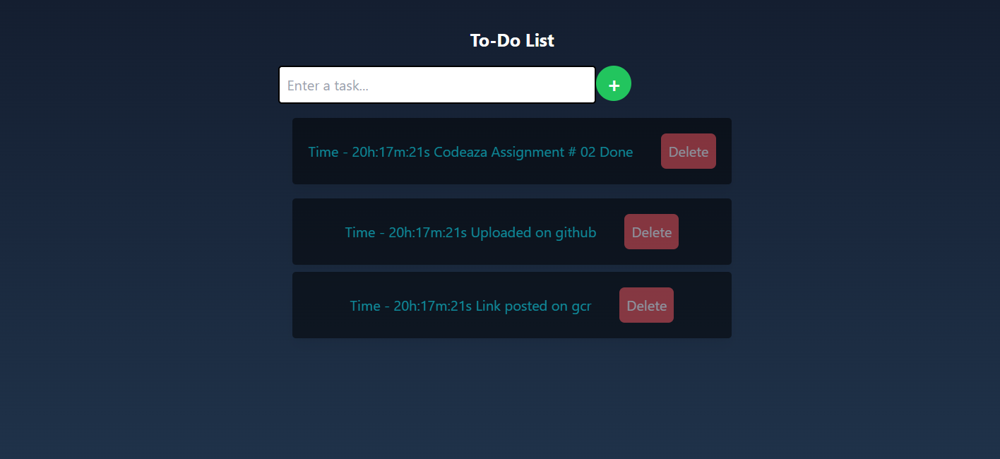
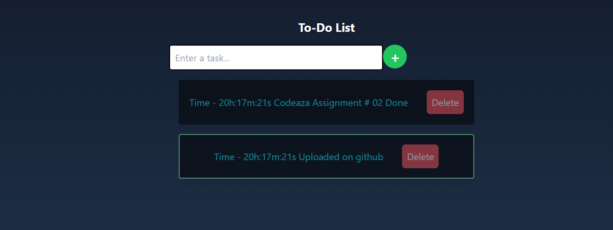
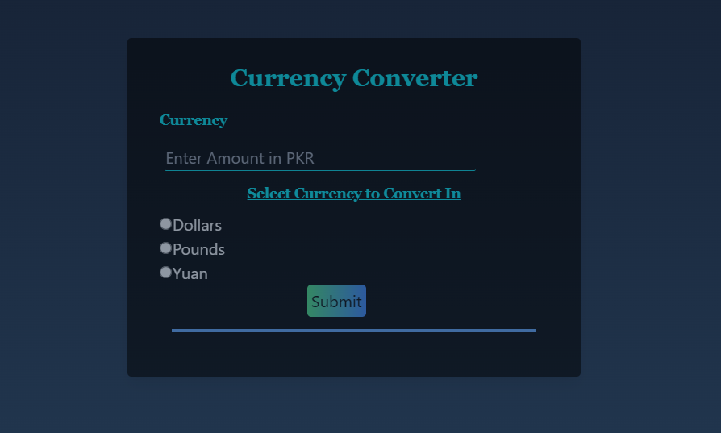
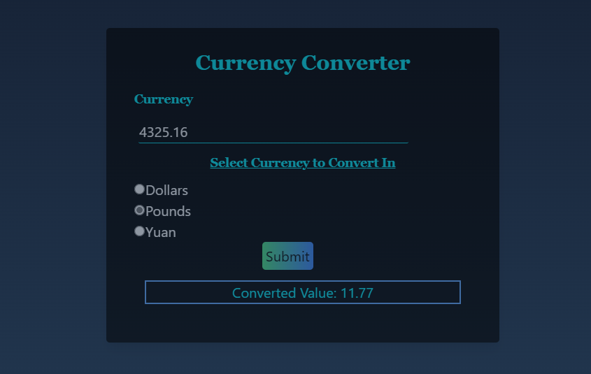

# Codeaza-Assignments

* 1 - clone the Repository<br>
* 2 - cd <desired project> i.e., currency_converter or to_do_list<br>
* 3 - open terminal and execute command:<br>
```
npm i
```
```
npm run dev
``` 
# To Do List
<br>
* GUI For To Do List<br><br>
<br>
* Adding Tasks to To Do List<br><br>
<br>
* Deleting Taks from To Do List<br><br>
<br>

 # Currency Converter
<br>
* GUI For Currency converter<br><br>
<br>
* Converted Price<br><br>
<br>